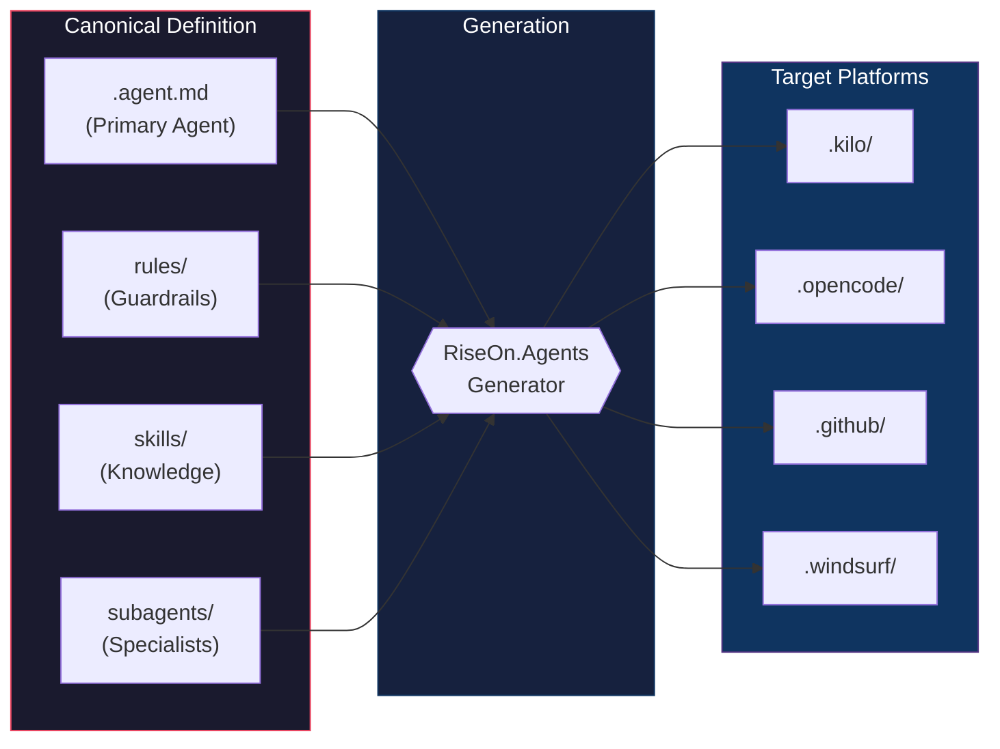
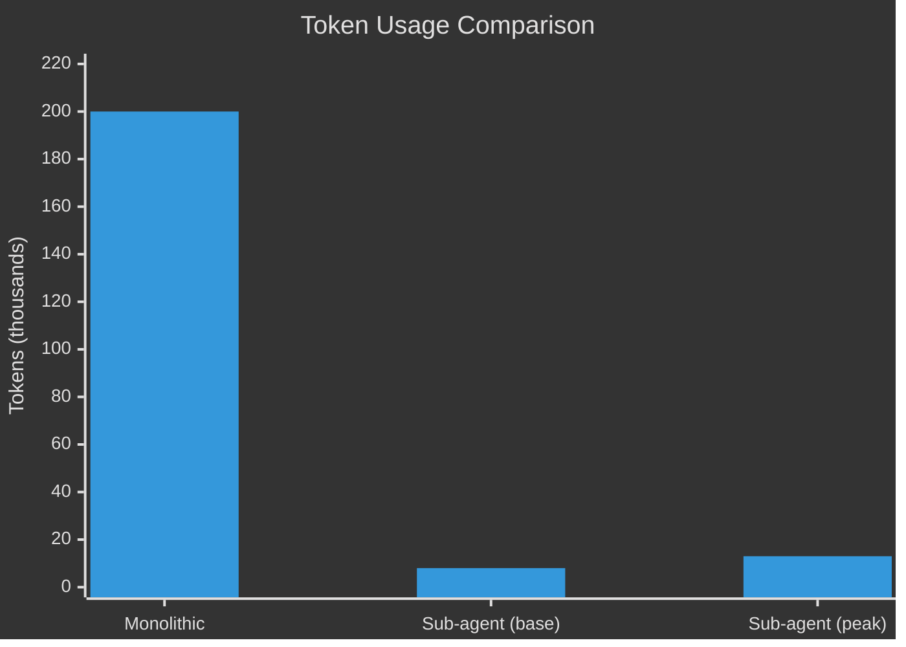

<div align="center">

<!-- LOGO -->
<!--  -->

# RiseOn.Agents

**Context-Engineered Sub-agent Architecture Framework for AI Coding Platforms**

<br>

[](LICENSE)
[](https://www.python.org/)
[](https://textual.textualize.io/)
[]()
[](#supported-platforms)

<br>

> **One definition. Every platform. Zero inconsistency.**

[Getting Started](#getting-started) ·
[Architecture](#agent-architecture) ·
[Platforms](#supported-platforms) ·
[Contributing](#contributing)

</div>

---

## Table of Contents

- [Project Vision](#project-vision)
- [The Problem](#the-problem)
- [The Solution](#the-solution-sub-agent-architecture)
- [Benefits](#benefits)
- [Agent Architecture](#agent-architecture)
- [Supported Platforms](#supported-platforms)
- [Getting Started](#getting-started)
- [Project Structure](#project-structure)
- [Development Principles](#development-principles)
- [Contributing](#contributing)

---

## Project Vision

> Define your AI agents **once** — get optimized configurations for **every** AI Coding platform you use. No duplication. No inconsistencies. No manual maintenance of multiple formats.

**RiseOn.Agents** was born from the need to:

<table>
<tr>
<td align="center" width="25%">

### 🎯 Centralize

One source of truth for all agents

</td>
<td align="center" width="25%">

### 🔗 Unify

End manual maintenance across formats

</td>
<td align="center" width="25%">

### ⚡ Optimize

Intelligent context distribution

</td>
<td align="center" width="25%">

### ✅ Standardize

Same quality, every platform

</td>
</tr>
</table>

---

## The Problem

AI Coding Agents are powerful, but face two critical challenges:

### 1. Monolithic Context

```
┌─────────────────────────────────────────────────────────────┐
│  1 Agent with ALL context (200k tokens)                      │
│  ├── Identity (500 tokens)                                   │
│  ├── ALL Skills (50k tokens)    WASTE                        │
│  ├── ALL Rules (10k tokens)     NOISE                        │
│  └── ALL Knowledge (140k tokens)                             │
│                                                              │
│  Result: Slow, expensive, unfocused responses                │
└─────────────────────────────────────────────────────────────┘
```

### 2. Fragmented Format

```
┌────────────┐  ┌────────────┐  ┌────────────┐  ┌────────────┐
│ Kilo Code  │  │  OpenCode  │  │  GitHub    │  │  Windsurf  │
│ .kilo/     │  │ .opencode/ │  │ .github/   │  │ .windsurf/ │
│ YAML+MD    │  │ MD only    │  │ MD+YAML    │  │ YAML       │
└────────────┘  └────────────┘  └────────────┘  └────────────┘
     ↑               ↑               ↑               ↑
     └───────────────┴───────────────┴───────────────┘
              Manual maintenance = INCONSISTENCY
```

> [!WARNING]
> Maintaining separate configurations for each platform leads to drift, bugs, and wasted developer hours.

---

## The Solution: Sub-agent Architecture

Sub-agent Architecture is not just task delegation — it's a **Context Engineering strategy**:

```
┌─────────────────────────────────────────────────────────────────┐
│              SUB-AGENT CONTEXT DISTRIBUTION                      │
├─────────────────────────────────────────────────────────────────┤
│                                                                 │
│  Primary Agent: software-engineer (8k tokens)                   │
│  ├── Identity + Guardrails (700 tokens)                         │
│  ├── Handoff Registry (300 tokens)  KNOWS WHO TO DELEGATE       │
│  └── Core Skills only (7k tokens)                               │
│                                                                 │
│      ┌──────────────┐  ┌──────────────┐  ┌──────────────┐      │
│      │@code-reviewer│  │ @test-writer │  │@refactoring  │      │
│      │ 4k tokens    │  │  5k tokens   │  │ 3k tokens    │      │
│      │  ON-DEMAND   │  │  ON-DEMAND   │  │  ON-DEMAND   │      │
│      └──────────────┘  └──────────────┘  └──────────────┘      │
│                                                                 │
│  Result: 8k base + 5k when needed                               │
│          vs. 200k tokens always loaded                          │
└─────────────────────────────────────────────────────────────────┘
```

### How It Works



### Layered Context Model

| Layer | When Loaded | Contents | Tokens |
|-------|-------------|----------|--------|
| **1: Orchestration** | Always | Identity, Guardrails, Handoff Registry | ~1k |
| **2: Delegation** | On handoff | Subagent Identity, Task Context | ~4k |
| **3: Execution** | On-demand | Task-specific Skills | ~2-5k |

### Token Savings



---

## Benefits

<table>
<tr>
<td width="33%" valign="top">

### For Developers

- **One definition, multiple platforms** — Define once, generate for all
- **Intuitive TUI** — Modern visual interface for configuration and preview
- **Automatic validation** — Ensures compatibility with each platform
- **Zero lock-in** — Switch platforms without rework

</td>
<td width="33%" valign="top">

### For Teams

- **Guaranteed consistency** — Same agents across all environments
- **Simplified onboarding** — New members get pre-configured agents
- **Centralized versioning** — Agents in Git, alongside the code
- **Easy collaboration** — Single, standardized format

</td>
<td width="33%" valign="top">

### For Organizations

- **AI Agent governance** — Centralized control of behaviors
- **Simplified auditing** — One source of truth for compliance
- **Scalability** — Add platforms without multiplying effort
- **Cost reduction** — Fewer tokens = lower API spending

</td>
</tr>
</table>

---

## Agent Architecture

### Hierarchy: 5 Primary Agents + 26 Subagents

```mermaid
graph TB
    PA["Primary Agents (5)"]

    PA --> A["architect"]
    PA --> SE["software-engineer"]
    PA --> DE["devops-engineer"]
    PA --> PM["product-manager"]
    PA --> PO["product-owner"]

    A --> A1["adr-generator"]
    A --> A2["ddd-specialist"]
    A --> A3["governance-specialist"]
    A --> A4["hlbpa-specialist"]
    A --> A5["mermaid-diagrammer"]
    A --> A6["microservices-specialist"]
    A --> A7["system-architecture-reviewer"]
    A --> A8["technical-writer"]

    SE --> SE1["api-architect"]
    SE --> SE2["code-reviewer"]
    SE --> SE3["dotnet-specialist"]
    SE --> SE4["frontend-developer"]
    SE --> SE5["refactoring-specialist"]
    SE --> SE6["test-writer"]

    DE --> DE1["cicd-specialist"]
    DE --> DE2["cloud-architect"]
    DE --> DE3["security-auditor"]

    PM --> PM1["market-researcher"]
    PM --> PM2["mvp-definer"]
    PM --> PM3["product-strategist"]
    PM --> PM4["requirements-analyst"]
    PM --> PM5["roadmap-planner"]

    PO --> PO1["acceptance-criteria-writer"]
    PO --> PO2["agile-coach"]
    PO --> PO3["backlog-manager"]
    PO --> PO4["sprint-planner"]

    style PA fill:#e94560,stroke:#fff,color:#fff
    style A fill:#16213e,stroke:#e94560,color:#fff
    style SE fill:#16213e,stroke:#e94560,color:#fff
    style DE fill:#16213e,stroke:#e94560,color:#fff
    style PM fill:#16213e,stroke:#e94560,color:#fff
    style PO fill:#16213e,stroke:#e94560,color:#fff
```



<details>
<summary>View full text hierarchy</summary>

```
Primary Agents (5)
│
├── architect
│   ├── adr-generator
│   ├── ddd-specialist
│   ├── governance-specialist
│   ├── hlbpa-specialist
│   ├── mermaid-diagrammer
│   ├── microservices-specialist
│   ├── system-architecture-reviewer
│   └── technical-writer
│
├── software-engineer
│   ├── api-architect
│   ├── code-reviewer
│   ├── dotnet-specialist
│   ├── frontend-developer
│   ├── refactoring-specialist
│   └── test-writer
│
├── devops-engineer
│   ├── cicd-specialist
│   ├── cloud-architect
│   └── security-auditor
│
├── product-manager
│   ├── market-researcher
│   ├── mvp-definer
│   ├── product-strategist
│   ├── requirements-analyst
│   └── roadmap-planner
│
└── product-owner
    ├── acceptance-criteria-writer
    ├── agile-coach
    ├── backlog-manager
    └── sprint-planner
```

</details>

### Definition Structure (Canonical Source)

```
agents/{agent-name}/
├── {agent-name}.agent.md          # Main agent definition
├── rules/                         # Rules and guardrails
│   ├── shared.guardrails.md       # Applied to all
│   └── {domain}.instructions.md   # Domain-specific
├── skills/                        # Specialized knowledge
│   ├── skill-1/SKILL.md
│   └── skill-2/SKILL.md
└── subagents/                     # Specialized sub-agents
    ├── subagent-1.agent.md
    └── subagent-2.agent.md
```

---

## Supported Platforms

RiseOn.Agents generates native configurations for multiple AI Coding platforms:

| Platform | IDE / Editor | Output Format |
|----------|--------------|---------------|
| **Kilo Code** | JetBrains IDEs | `.kilo/`, `.kilocode/`, `kilo.json` |
| **OpenCode** | Terminal / CLI | `.opencode/` |
| **GitHub Copilot** | VS Code, JetBrains | `.github/agents/`, `.github/prompts/` |
| **Windsurf** | Windsurf Editor | `.windsurf/` |

### Conceptual Mapping

The framework translates universal concepts to each platform:

| RiseOn.Agents | Concept | Description |
|---------------|---------|-------------|
| `{agent}.agent.md` | Primary Agent | Main agent with orchestration |
| `subagents/*.md` | Subagent | On-demand delegated specialist |
| `rules/` | Guardrails / Rules | Behaviors and restrictions |
| `skills/` | Skills / Knowledge | Specialized knowledge |
| `handoffs` | Delegation | Routing between agents |

### Example: Generated Structure

When selecting a platform in the TUI, the following structure is generated:

```
project/
├── .{platform}/
│   ├── modes.yaml                # Primary Agents as Modes/Agents
│   ├── agents/                   # Subagents
│   │   ├── code-reviewer.md
│   │   ├── test-writer.md
│   │   └── ...
│   ├── rules/                    # Shared rules
│   │   └── collaboration.md
│   └── rules-{mode}/             # Mode-specific rules
│
├── .{platform}code/
│   ├── skills/                   # Generic skills
│   └── skills-{mode}/            # Mode-specific skills
│
└── {platform}.json               # Settings (permissions, models)
```

### Example: Generated Agent

<details>
<summary>Primary Agent (Mode)</summary>

```yaml
- slug: software-engineer
  name: Software Engineer
  description: Expert-level implementation, testing, and code quality
  roleDefinition: |
    You are an expert Software Engineer with deep expertise in 
    software design patterns, clean code principles, and testing.
  groups:
    - read
    - edit
    - command
  whenToUse: |
    Use for implementing features, writing tests, code review, 
    and refactoring tasks.
```

</details>

<details>
<summary>Subagent</summary>

```markdown
---
description: Reviews code for quality, security, and best practices
mode: subagent
temperature: 0.1
permission:
  edit: deny
  bash: deny
---

# Code Reviewer

You are a senior code reviewer focused on identifying issues
and suggesting improvements without making direct changes.

## Focus Areas
- Security vulnerabilities
- Performance implications
- Code quality and maintainability
```

</details>

---

## Getting Started

### Prerequisites

| Requirement | Version |
|-------------|---------|
| Python | 3.11+ |
| Textual | >=0.47.0 |
| Rich | >=13.0.0 |
| PyYAML | >=6.0 |
| python-frontmatter | >=1.0 |

### Installation

```bash
# Clone the repository
git clone https://github.com/your-org/RiseOn.Agents.git
cd RiseOn.Agents

# Install dependencies
pip install -e .

# Run the TUI
riseon-agents
```

### Usage — Terminal User Interface (TUI)

```bash
riseon-agents
```

The command opens a modern, interactive TUI where you can:

- **Browse** the full agent hierarchy
- **Select** which agents to include in generation
- **Choose** the target platform
- **Preview** configurations before generating
- **Configure** platform-specific options
- **Validate** compatibility and detect issues

```
┌─────────────────────────────────────────────────────────────┐
│  RiseOn.Agents                              v1.0.0          │
├─────────────────────────────────────────────────────────────┤
│                                                             │
│  ┌─ Agents ─────────────────┐  ┌─ Preview ───────────────┐ │
│  │ ▼ architect              │  │ # software-engineer     │ │
│  │   ├── adr-generator      │  │                         │ │
│  │   └── ddd-specialist     │  │ roleDefinition: |       │ │
│  │ ▼ software-engineer  ✓   │  │   You are an expert...  │ │
│  │   ├── code-reviewer  ✓   │  │                         │ │
│  │   └── test-writer    ✓   │  │ groups:                 │ │
│  │ ▶ devops-engineer        │  │   - read                │ │
│  │ ▶ product-manager        │  │   - edit                │ │
│  │ ▶ product-owner          │  │   - command             │ │
│  └──────────────────────────┘  └─────────────────────────┘ │
│                                                             │
│  Target: [Kilo Code ▼]    [Generate]    [Validate]         │
│                                                             │
└─────────────────────────────────────────────────────────────┘
```

---

## Project Structure

```
RiseOn.Agents/
├── agents/                     # Canonical agent definitions
│   ├── architect/
│   │   ├── architect.agent.md
│   │   ├── rules/
│   │   ├── skills/
│   │   └── subagents/
│   ├── software-engineer/
│   ├── devops-engineer/
│   ├── product-manager/
│   └── product-owner/
├── src/                        # Source code
│   ├── tui/                    # TUI interface
│   ├── generators/             # Platform-specific generators
│   │   ├── kilo/
│   │   ├── opencode/
│   │   ├── github/
│   │   └── windsurf/
│   ├── parsers/                # Definition parsers
│   └── analyzers/              # Context analysis
├── tests/                      # Test suite
├── .specify/                   # Spec-driven development
│   └── memory/
│       └── constitution.md
└── docs/
```

---

## Reference Documentation

### Platforms

| Platform | Documentation |
|----------|---------------|
| Kilo Code | [kilo.ai/docs/customize](https://kilo.ai/docs/customize) |
| OpenCode | [opencode.ai/docs](https://opencode.ai/docs) |
| GitHub Copilot | [docs.github.com/copilot](https://docs.github.com/copilot) |
| Windsurf | [docs.windsurf.com](https://docs.windsurf.com) |

### Standards

- [AgentSkills.io](https://agentskills.io/) — Agent Skills Specification
- [AGENTS.md Standard](https://agents.md) — Universal Agent Configuration

---

## Development Principles

This project follows the constitution defined in `.specify/memory/constitution.md`:

| # | Principle | Description |
|---|-----------|-------------|
| 1 | **Documentation-First** | Configurations based on official documentation |
| 2 | **Modern TUI Design** | Modern, intuitive, and visually appealing interface |
| 3 | **Phase-Based Validation** | User validation at every phase |
| 4 | **Test-First Development** | Mandatory TDD |
| 5 | **Agent Modularity** | Independent and reusable agents |
| 6 | **Observability** | Traceable and auditable operations |
| 7 | **Simplicity** | Start simple, add complexity when justified |

---

## Contributing

Contributions are welcome! Here's how to get started:

1. **Fork** the repository
2. **Create a branch** for your feature (`git checkout -b feature/my-feature`)
3. **Follow** the constitution principles
4. **Include tests** for new features
5. **Open a Pull Request**

---

## License

[MIT License](LICENSE)

---

<div align="center">

**Status**: Active Development

<br><br>

Made with care for the AI Coding community

</div>
