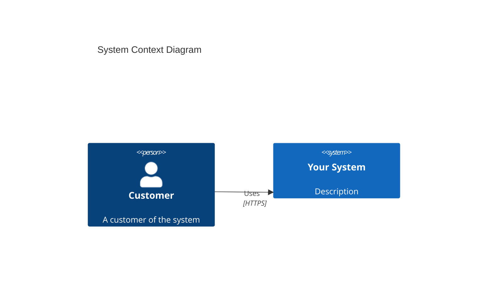
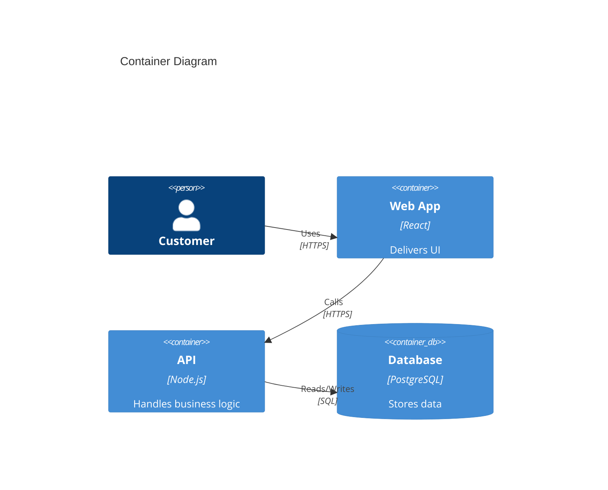
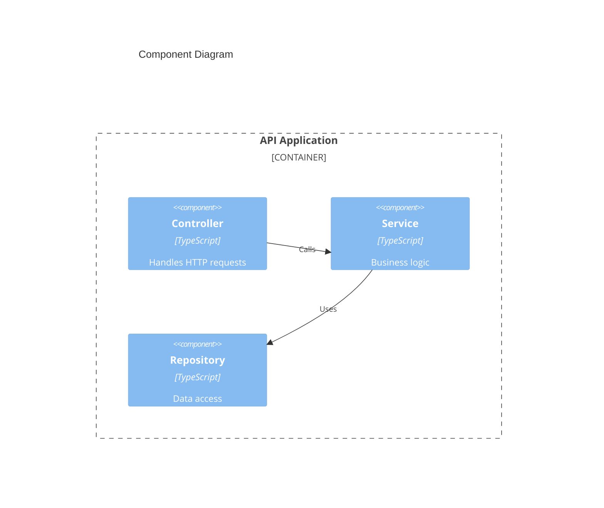

# C4 Diagram Patterns

A collection of patterns and templates for creating C4 model architecture diagrams. The C4 model provides a consistent way to communicate software architecture at different levels of abstraction.

## When to Use This Skill

Use this skill when:
- Creating software architecture documentation
- Visualizing system structure for stakeholders
- Onboarding new team members
- Planning system evolution
- Communicating with technical or non-technical audiences

---

## C4 Model Overview

The C4 model has 4 levels of hierarchy:

| Level | Name | Audience | What It Shows |
|-------|------|----------|---------------|
| **L1** | System Context | Everyone | System and users/external systems |
| **L2** | Containers | Technical people | Major technology choices |
| **L3** | Components | Developers | Internal structure of containers |
| **L4** | Code | Developers | Classes/interfaces (usually auto-generated) |

**Note**: This skill focuses on L1-L3. L4 is typically generated from code.

---

## Level 1: System Context Diagram

**Purpose**: Show your system in the context of the world around it.

### Elements
- **Person**: Human users (e.g., "Customer", "Admin")
- **Software System**: Your system + external systems
- **Relationships**: Arrows showing interactions

### Template Structure
```
┌─────────────────────────────────────────────┐
│         External System A                   │
│              ↑ ↓                            │
│    ┌─────────┴──────┐                       │
│    │   Your System  │ ←───── Person         │
│    └─────────┬──────┘                       │
│              ↓ ↑                            │
│         External System B                   │
└─────────────────────────────────────────────┘
```

### When to Use
- Project kickoff
- Stakeholder presentations
- Architecture decision records
- Documentation overview

### Best Practices
- Keep it simple (5-10 external systems max)
- Use clear, descriptive names
- Show direction of data flow
- Include brief descriptions on relationships

---

## Level 2: Container Diagram

**Purpose**: Show the high-level technology choices and how they interact.

### What is a Container?
A container = an independently deployable/runtime unit:
- Web application (React, Angular)
- Mobile app (iOS, Android)
- Server-side application (Node.js, .NET)
- Database (PostgreSQL, MongoDB)
- File system
- Microservice

**NOT**: Docker containers (though they can be)

### Template Structure
```
┌────────────────────────────────────────────────────┐
│                    Person                          │
│                       ↓                            │
│    ┌──────────────────────────────────┐            │
│    │     Web Application              │            │
│    │     [React, TypeScript]          │            │
│    └─────────────┬────────────────────┘            │
│                  │ HTTPS                           │
│                  ↓                                 │
│    ┌──────────────────────────────────┐            │
│    │     API Application              │            │
│    │     [Node.js, Express]           │──┐         │
│    └──────────────────────────────────┘  │         │
│                                           ↓         │
│                              ┌──────────────────┐   │
│                              │    Database      │   │
│                              │  [PostgreSQL]    │   │
│                              └──────────────────┘   │
└────────────────────────────────────────────────────┘
```

### When to Use
- Technical design reviews
- Technology stack decisions
- Integration planning
- Team onboarding (developers)

### Best Practices
- Show technology choices explicitly
- Group related containers
- Label all relationships with protocol (HTTPS, gRPC, etc.)
- Keep to 10-15 containers max per diagram

---

## Level 3: Component Diagram

**Purpose**: Show how a container is made up of components.

### What is a Component?
A component = a grouping of related functionality:
- Service classes
- Controllers
- Repositories
- Modules
- Libraries

### Template Structure
```
┌─────────────────────────────────────────────────────┐
│              API Application                         │
│              [Node.js, Express]                      │
├─────────────────────────────────────────────────────┤
│  ┌──────────────┐   ┌──────────────┐                │
│  │  Controller  │ → │   Service    │                │
│  └──────────────┘   └──────┬───────┘                │
│                            ↓                        │
│                     ┌──────────────┐                │
│                     │  Repository  │                │
│                     └──────┬───────┘                │
│                            ↓                        │
│                     ┌──────────────┐                │
│                     │   Domain     │                │
│                     └──────────────┘                │
└─────────────────────────────────────────────────────┘
```

### When to Use
- Detailed design reviews
- Code refactoring planning
- Component ownership discussions
- Technical debt identification

### Best Practices
- Focus on one container per diagram
- Show 5-15 components (not too many)
- Use consistent naming (Controller, Service, Repository)
- Show dependencies clearly

---

## Common C4 Patterns

### Pattern 1: Web Application Architecture
```
Person (Customer)
    ↓ HTTPS
Web Application [React]
    ↓ API
API Application [Node.js]
    ├─→ Database [PostgreSQL]
    ├─→ Cache [Redis]
    └─→ Message Queue [RabbitMQ]
```

### Pattern 2: Microservices Architecture
```
Person (Customer)
    ↓
API Gateway [Kong]
    ├─→ Auth Service
    ├─→ Order Service → Orders DB
    ├─→ Product Service → Products DB
    └─→ Notification Service → Email/SMS
```

### Pattern 3: Event-Driven Architecture
```
Service A
    ↓ publishes
[Event Bus / Kafka]
    ↓ subscribes
Service B, Service C, Service D
```

### Pattern 4: CQRS Pattern
```
                    ┌─→ Command Side → Write DB
Person ──┬──────────┤
         │          └─→ Query Side → Read DB
         └─────────────────────→ Read DB (direct)
```

### Pattern 5: Strangler Fig Modernization
```
         ┌─→ Legacy System
Router ──┤
         └─→ New Service A
         └─→ New Service B
         └─→ New Service C
```

---

## Mermaid C4 Templates

### System Context (Mermaid)


### Container (Mermaid)


### Component (Mermaid)


---

## Guidelines for All C4 Diagrams

### Naming Conventions
- **People**: Role-based (Customer, Admin, Support)
- **Systems**: Noun + System (Payment System, Inventory System)
- **Containers**: Name + Type (Web App, API, Database)
- **Components**: Responsibility-based (AuthController, OrderService)

### Relationship Labels
Always describe **what** and **how**:
- ✅ "Uses HTTPS"
- ✅ "Reads/Writes SQL"
- ✅ "Publishes events to"
- ❌ "Connects to" (too vague)

### Color Coding (Optional)
- **Blue**: Your system/components
- **Gray**: External systems
- **Green**: Databases
- **Yellow**: People/Users

### Complexity Management
If a diagram has too many elements:
1. **L1**: Group external systems by domain
2. **L2**: Split into multiple diagrams by bounded context
3. **L3**: One diagram per container

---

## Output Format

When using this skill, provide:
1. **Diagram type** (L1, L2, or L3)
2. **Mermaid code** (for rendering in Markdown)
3. **Element list** (people, systems, containers, components)
4. **Relationship list** (with labels)
5. **Key decisions** (why this structure)

---

## Related Skills

- **excalidraw-diagram-generator**: For visual, hand-drawn style diagrams
- **architecture-blueprint-generator**: For complete architecture documentation
- **create-architectural-decision-record**: For documenting C4-related decisions

---

## References

- [C4 Model](https://c4model.com/) - Official C4 Model website
- [Structurizr](https://structurizr.com/) - C4 tooling
- [Mermaid C4](https://mermaid.js.org/syntax/c4.html) - Mermaid C4 syntax reference

---

## Examples

### Example 1: E-commerce System Context
```
Persons: Customer, Admin, Payment Gateway
Systems: E-commerce Platform, Email Service, Analytics Service
```

### Example 2: Microservices Container Diagram
```
Containers: API Gateway, Auth Service, Order Service, Product Service, 
            PostgreSQL (Orders), MongoDB (Products), Redis (Cache)
```

### Example 3: Auth Service Components
```
Components: AuthController, AuthService, JwtService, UserRepository, 
            PasswordHasher, EmailService
```
