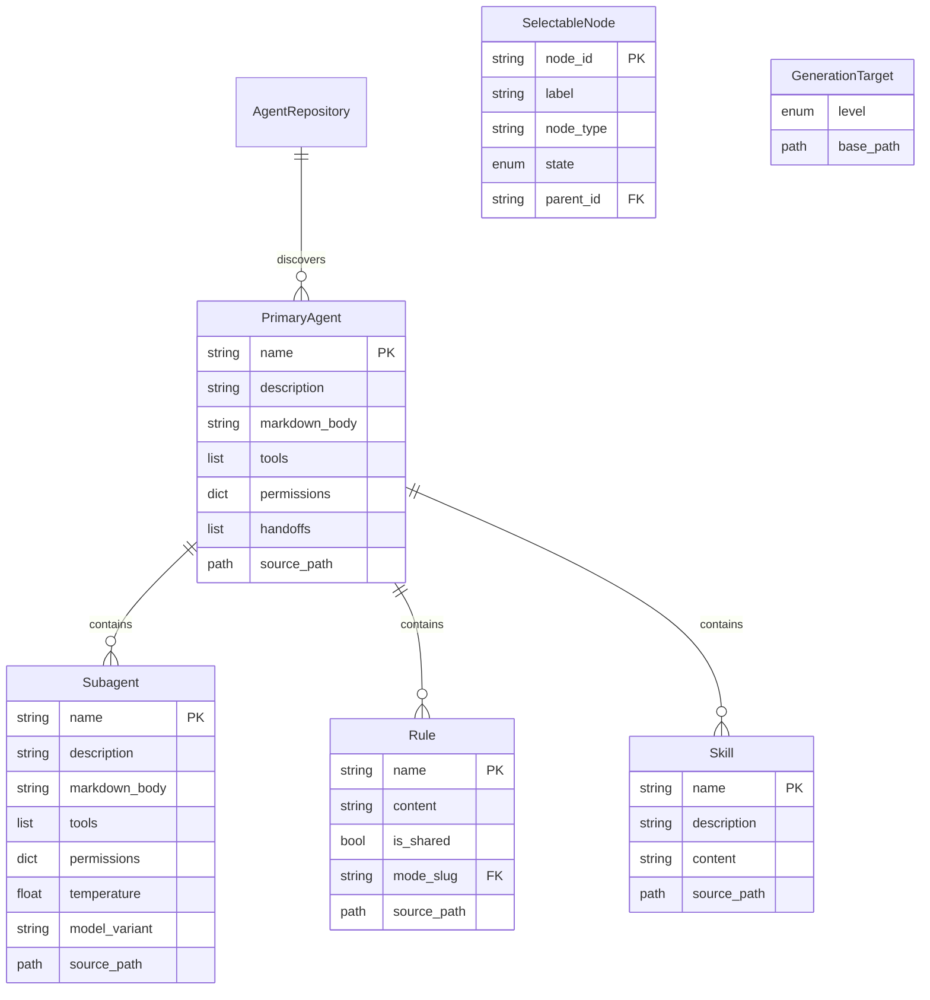
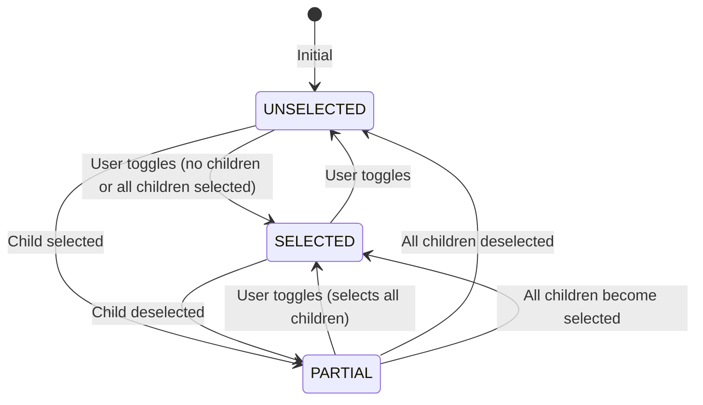
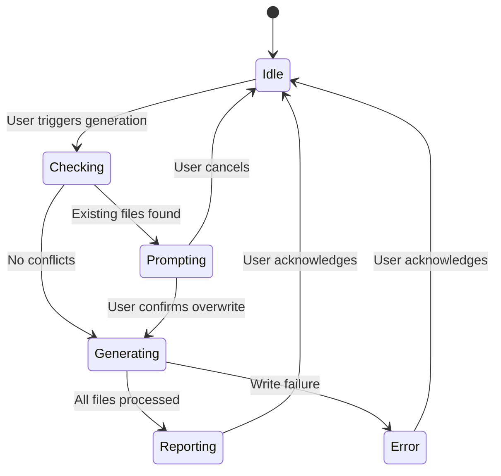

# Data Model: Kilo Code Configuration Generator

**Feature Branch**: `002-kilocode-generator`  
**Date**: 2026-03-30  
**Status**: Complete

## Entity Overview

```
┌─────────────────────────────────────────────────────────────────┐
│                        AgentRepository                          │
│  (discovers and loads all agents from agents/ folder)           │
└─────────────────────────────────────────────────────────────────┘
                              │
                              ▼
┌─────────────────────────────────────────────────────────────────┐
│                        PrimaryAgent                             │
│  - name: str                                                    │
│  - description: str                                             │
│  - markdown_body: str                                           │
│  - tools: list[str]                                             │
│  - permissions: dict[str, str]                                  │
│  - handoffs: list[str]                                          │
│  - subagents: list[Subagent]                                    │
│  - rules: list[Rule]                                            │
│  - skills: list[Skill]                                          │
│  - source_path: Path                                            │
└─────────────────────────────────────────────────────────────────┘
         │ 1:N              │ 1:N              │ 1:N
         ▼                  ▼                  ▼
┌─────────────────┐ ┌─────────────────┐ ┌─────────────────┐
│    Subagent     │ │      Rule       │ │      Skill      │
│ - name          │ │ - name          │ │ - name          │
│ - description   │ │ - content       │ │ - description   │
│ - markdown_body │ │ - source_path   │ │ - content       │
│ - tools         │ │ - is_shared     │ │ - source_path   │
│ - permissions   │ └─────────────────┘ └─────────────────┘
│ - temperature   │
│ - model_variant │
│ - source_path   │
└─────────────────┘
```

## Entity Definitions

### 1. PrimaryAgent

Represents a top-level agent that can have subagents, rules, and skills.

```python
from dataclasses import dataclass, field
from pathlib import Path
from enum import Enum

class PermissionLevel(Enum):
    ALLOW = "allow"
    ASK = "ask"
    DENY = "deny"

@dataclass
class PrimaryAgent:
    """Primary agent definition (maps to Kilo Code Custom Mode)."""
    
    # Identity
    name: str                           # Unique identifier (slug)
    description: str                    # Short description for UI
    
    # Content
    markdown_body: str                  # Instructions (becomes roleDefinition)
    
    # Configuration
    tools: list[str] = field(default_factory=list)
    temperature: float = 0.1
    steps: int = 40
    permissions: dict[str, PermissionLevel] = field(default_factory=dict)
    handoffs: list[str] = field(default_factory=list)  # subagent names
    
    # Children
    subagents: list["Subagent"] = field(default_factory=list)
    rules: list["Rule"] = field(default_factory=list)
    skills: list["Skill"] = field(default_factory=list)
    
    # Metadata
    source_path: Path | None = None
    
    @property
    def slug(self) -> str:
        """Generate Kilo Code compatible slug."""
        return self.name.lower().replace("_", "-")
    
    @property
    def display_name(self) -> str:
        """Generate human-readable display name."""
        return self.name.replace("-", " ").replace("_", " ").title()
```

**Validation Rules**:
- `name` MUST be non-empty and match `/^[a-zA-Z0-9_-]+$/`
- `description` MUST be non-empty
- `markdown_body` MUST be non-empty
- `permissions` keys MUST be in ["edit", "bash", "webfetch", "mcp"]
- `source_path` MUST exist and be readable

### 2. Subagent

Represents a specialized agent invoked by primary agents.

```python
@dataclass
class Subagent:
    """Subagent definition (maps to Kilo Code Custom Subagent)."""
    
    # Identity
    name: str                           # Unique identifier
    description: str                    # What the agent does
    
    # Content
    markdown_body: str                  # System prompt instructions
    
    # Configuration
    tools: list[str] = field(default_factory=list)
    temperature: float = 0.1
    steps: int = 15
    permissions: dict[str, PermissionLevel] = field(default_factory=dict)
    model_variant: str | None = None    # e.g., "high", "low"
    target: str = "opencode"            # Target platform
    
    # Metadata
    source_path: Path | None = None
    parent_agent: str | None = None     # Name of parent primary agent
```

**Validation Rules**:
- `name` MUST be non-empty and match `/^[a-zA-Z0-9_-]+$/`
- `description` MUST be non-empty
- `markdown_body` MUST be non-empty
- `model_variant` MUST be in [None, "high", "low", "medium"]
- `source_path` MUST exist and be readable

### 3. Rule

Represents a behavioral guideline or guardrail.

```python
@dataclass
class Rule:
    """Rule definition (maps to Kilo Code Custom Rules)."""
    
    # Identity
    name: str                           # Derived from filename
    
    # Content
    content: str                        # Markdown content
    
    # Configuration
    is_shared: bool = True              # True = all modes, False = mode-specific
    mode_slug: str | None = None        # If not shared, which mode
    
    # Metadata
    source_path: Path | None = None
```

**Validation Rules**:
- `name` MUST be non-empty
- `content` MUST be non-empty
- If `is_shared` is False, `mode_slug` MUST be set
- `source_path` MUST exist and be readable

### 4. Skill

Represents a reusable knowledge module.

```python
@dataclass
class Skill:
    """Skill definition (maps to Kilo Code Skills)."""
    
    # Identity (from SKILL.md frontmatter)
    name: str                           # Max 64 chars, [a-z0-9-]+
    description: str                    # Max 1024 chars
    
    # Content
    content: str                        # Full SKILL.md content including frontmatter
    
    # Optional metadata
    license: str | None = None
    metadata: dict[str, str] = field(default_factory=dict)
    
    # Resources
    has_scripts: bool = False           # Has scripts/ directory
    has_references: bool = False        # Has references/ directory
    has_assets: bool = False            # Has assets/ directory
    
    # Metadata
    source_path: Path | None = None     # Path to SKILL.md
    source_dir: Path | None = None      # Path to skill directory
```

**Validation Rules**:
- `name` MUST match `/^[a-z0-9-]+$/` and be <= 64 chars
- `name` MUST NOT start or end with hyphen
- `description` MUST be non-empty and <= 1024 chars
- `source_path` MUST point to valid SKILL.md file

## Selection State Model

For TUI tree selection functionality:

```python
from enum import Enum, auto

class SelectionState(Enum):
    """Tri-state selection for tree nodes."""
    UNSELECTED = auto()   # ☐ Not selected
    SELECTED = auto()     # ☑ Fully selected
    PARTIAL = auto()      # ◪ Some children selected

@dataclass
class SelectableNode:
    """Tree node with selection state."""
    
    # Node identity
    node_id: str                        # Unique within tree
    label: str                          # Display text
    node_type: str                      # "primary", "subagent", "rule", "skill"
    
    # Selection
    state: SelectionState = SelectionState.UNSELECTED
    
    # Hierarchy
    parent_id: str | None = None
    children_ids: list[str] = field(default_factory=list)
    
    # Data reference
    data: PrimaryAgent | Subagent | Rule | Skill | None = None
```

## Generation Level Model

```python
class GenerationLevel(Enum):
    """Where to generate configuration files."""
    LOCAL = "local"     # Project: ./.kilo/
    GLOBAL = "global"   # User: ~/.kilocode/

@dataclass
class GenerationTarget:
    """Target configuration for generation."""
    
    level: GenerationLevel
    base_path: Path                     # Resolved absolute path
    
    @property
    def modes_file(self) -> Path:
        """Path to custom_modes.yaml."""
        if self.level == GenerationLevel.LOCAL:
            return self.base_path / "custom_modes.yaml"
        return self.base_path / "custom_modes.yaml"
    
    @property
    def agents_dir(self) -> Path:
        """Path to agents directory."""
        if self.level == GenerationLevel.LOCAL:
            return self.base_path / ".kilo" / "agents"
        return self.base_path / "agents"
    
    @property
    def rules_dir(self) -> Path:
        """Path to shared rules directory."""
        if self.level == GenerationLevel.LOCAL:
            return self.base_path / ".kilo" / "rules"
        return self.base_path / "rules"
    
    def rules_mode_dir(self, mode_slug: str) -> Path:
        """Path to mode-specific rules directory."""
        if self.level == GenerationLevel.LOCAL:
            return self.base_path / ".kilo" / f"rules-{mode_slug}"
        return self.base_path / f"rules-{mode_slug}"
    
    @property
    def skills_dir(self) -> Path:
        """Path to skills directory."""
        if self.level == GenerationLevel.LOCAL:
            return self.base_path / ".kilocode" / "skills"
        return self.base_path / "skills"
```

## Generation Result Model

```python
from enum import Enum

class FileStatus(Enum):
    """Status of a generated file."""
    CREATED = "created"
    UPDATED = "updated"
    SKIPPED = "skipped"
    ERROR = "error"

@dataclass
class GeneratedFile:
    """Result of generating a single file."""
    
    path: Path
    status: FileStatus
    error_message: str | None = None
    existed_before: bool = False

@dataclass
class GenerationResult:
    """Complete result of a generation operation."""
    
    files: list[GeneratedFile] = field(default_factory=list)
    
    @property
    def created_count(self) -> int:
        return sum(1 for f in self.files if f.status == FileStatus.CREATED)
    
    @property
    def updated_count(self) -> int:
        return sum(1 for f in self.files if f.status == FileStatus.UPDATED)
    
    @property
    def skipped_count(self) -> int:
        return sum(1 for f in self.files if f.status == FileStatus.SKIPPED)
    
    @property
    def error_count(self) -> int:
        return sum(1 for f in self.files if f.status == FileStatus.ERROR)
    
    @property
    def success(self) -> bool:
        return self.error_count == 0
```

## Kilo Code Output Models

For serialization to Kilo Code format:

```python
from typing import TypedDict, NotRequired

class KiloModeGroup(TypedDict):
    """Tool group with optional file restrictions."""
    fileRegex: NotRequired[str]
    description: NotRequired[str]

class KiloCustomMode(TypedDict):
    """Kilo Code custom mode schema."""
    slug: str
    name: str
    description: str
    roleDefinition: str
    whenToUse: NotRequired[str]
    customInstructions: NotRequired[str]
    groups: list[str | tuple[str, KiloModeGroup]]

class KiloModesFile(TypedDict):
    """custom_modes.yaml root schema."""
    customModes: list[KiloCustomMode]

class KiloSubagentFrontmatter(TypedDict):
    """Subagent markdown frontmatter schema."""
    description: str
    mode: str  # Always "subagent"
    temperature: NotRequired[float]
    model: NotRequired[str]
    permission: NotRequired[dict[str, str]]
```

## Entity Relationships Diagram



## State Transitions

### Selection State Machine



### Generation Flow


