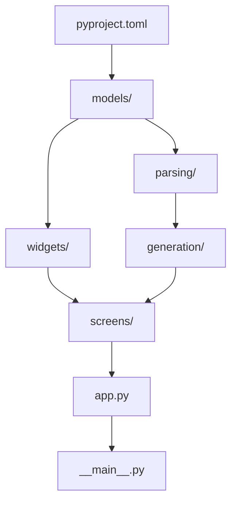

# Implementation Plan: Kilo Code Configuration Generator

**Branch**: `002-kilocode-generator` | **Date**: 2026-03-30 | **Spec**: [spec.md](./spec.md)
**Input**: Feature specification from `/specs/002-kilocode-generator/spec.md`

## Summary

Build a modern TUI application that transforms centralized agent definitions (agents/ folder) into native Kilo Code configurations. The TUI provides hierarchical tree navigation with tri-state selection, real-time preview, and generation to Local (.kilo/) or Global (~/.kilocode/) targets. Implementation uses Python 3.11+ with Textual/Rich framework, following the constitution's mandate for modern TUI design and phase-based validation.

## Technical Context

**Language/Version**: Python 3.11+  
**Primary Dependencies**: Textual >=0.47.0, Rich >=13.0.0, PyYAML >=6.0, python-frontmatter >=1.0  
**Storage**: Local filesystem (agents/ folder read, .kilo/ and ~/.kilocode/ write)  
**Testing**: pytest >=7.0, pytest-asyncio >=0.21  
**Target Platform**: Linux/macOS/Windows terminals with Unicode support  
**Project Type**: CLI/TUI Application  
**Performance Goals**: Tree load <2s, Preview <500ms, Full generation <10s (from SC-001, SC-004, SC-005)  
**Constraints**: No network required, graceful degradation for malformed inputs  
**Scale/Scope**: 5 Primary Agents, 26 Subagents, ~60 Rules, ~60 Skills

## Constitution Check

*GATE: Must pass before Phase 0 research. Re-check after Phase 1 design.*

| Principle | Status | Evidence |
|-----------|--------|----------|
| I. Documentation-First | PASS | Kilo Code mappings based on official docs at kilo.ai/docs/customize |
| II. Modern TUI Design | PASS | Textual/Rich framework per constitution; 2-panel layout with keyboard-first navigation |
| III. Phase-Based Validation | PASS | Plan includes validation gates per phase |
| IV. Test-First Development | PASS | pytest with TDD approach defined |
| V. Agent Modularity | PASS | Agents parsed independently, self-contained data model |
| VI. Observability | PASS | Generation results with file-level status |
| VII. Simplicity Over Complexity | PASS | Direct string generation (no Jinja2), dataclasses (no Pydantic) |

**Technology Standards Check**:
- Python 3.11+ with type hints: PASS
- Textual/Rich for TUI: PASS
- Linting (Ruff, Black) and type checking (mypy): PASS
- Conventional commits: Will follow

## Project Structure

### Documentation (this feature)

```text
specs/002-kilocode-generator/
├── plan.md              # This file
├── research.md          # Phase 0 output - COMPLETE
├── data-model.md        # Phase 1 output - COMPLETE
├── quickstart.md        # Phase 1 output - COMPLETE
├── contracts/           # Phase 1 output - COMPLETE
│   ├── tui-interactions.md
│   └── generator-output.md
└── tasks.md             # Phase 2 output (via /speckit.tasks)
```

### Source Code (repository root)

```text
src/riseon_agents/
├── __init__.py          # Package initialization, version
├── __main__.py          # Entry point: python -m riseon_agents
├── app.py               # KiloGeneratorApp(App) - main Textual app
│
├── models/              # Data classes (from data-model.md)
│   ├── __init__.py
│   ├── agent.py         # PrimaryAgent, Subagent, PermissionLevel
│   ├── rule.py          # Rule
│   ├── skill.py         # Skill
│   ├── selection.py     # SelectionState, SelectableNode
│   └── generation.py    # GenerationLevel, GenerationTarget, GenerationResult
│
├── parsing/             # Agent discovery and parsing
│   ├── __init__.py
│   ├── frontmatter.py   # YAML frontmatter + Markdown body parser
│   └── repository.py    # AgentRepository - discovers all agents
│
├── generation/          # Kilo Code file generation
│   ├── __init__.py
│   ├── generator.py     # KiloCodeGenerator orchestrator
│   ├── modes.py         # custom_modes.yaml generator
│   ├── subagents.py     # .kilo/agents/*.md generator
│   ├── rules.py         # .kilo/rules/ and rules-{mode}/ generator
│   └── skills.py        # .kilocode/skills/ generator
│
├── widgets/             # Custom Textual widgets
│   ├── __init__.py
│   ├── agent_tree.py    # SelectableTree extending Tree
│   └── preview.py       # PreviewPanel for configuration preview
│
└── screens/             # Textual screens
    ├── __init__.py
    ├── main.py          # MainScreen with tree + preview layout
    └── dialogs.py       # ConfirmDialog, ErrorDialog, ResultDialog

tests/
├── conftest.py          # Shared fixtures (sample agents, temp dirs)
├── fixtures/            # Test data
│   └── agents/          # Sample agent definitions
├── test_models/
│   ├── test_agent.py
│   ├── test_selection.py
│   └── test_generation.py
├── test_parsing/
│   ├── test_frontmatter.py
│   └── test_repository.py
├── test_generation/
│   ├── test_modes.py
│   ├── test_subagents.py
│   ├── test_rules.py
│   └── test_skills.py
└── test_widgets/
    ├── test_agent_tree.py
    └── test_preview.py
```

**Structure Decision**: Single-project layout with clear separation:
- `models/` - Pure data classes, no dependencies on UI
- `parsing/` - Input handling, reads filesystem
- `generation/` - Output handling, writes filesystem  
- `widgets/` - Textual UI components
- `screens/` - Textual app screens

## Complexity Tracking

> No violations to justify. All decisions follow constitution simplicity principle.

| Decision | Rationale | Alternative Rejected |
|----------|-----------|----------------------|
| dataclasses over Pydantic | No validation complexity needed | Pydantic adds dependency, overkill for this scope |
| Direct string building over Jinja2 | YAML output is simple and structured | Jinja2 adds dependency for minimal benefit |
| 2-panel layout over 3-panel | Simpler UX, focuses on primary workflow | 3-panel too crowded for terminal |

## Implementation Phases

### Phase 1: Foundation (MVP Core)

**Objective**: Parseable agents, displayable tree, basic generation

**Tasks**:
1. Project scaffolding (pyproject.toml, src/ layout)
2. Data models (PrimaryAgent, Subagent, Rule, Skill)
3. Frontmatter parser
4. AgentRepository discovery
5. Basic Textual app with Tree widget
6. custom_modes.yaml generation

**Validation Gate**: 
- `pytest` passes
- TUI launches and shows agent tree
- Can generate custom_modes.yaml for one agent

### Phase 2: Selection & Preview (MVP Complete)

**Objective**: Tri-state selection, preview panel, full generation

**Tasks**:
1. SelectableTree widget with tri-state
2. Preview panel with syntax highlighting
3. Subagent generation
4. Rules generation
5. Skills generation
6. Generation progress indicator

**Validation Gate**:
- Selection propagation works correctly
- Preview updates on selection
- Full generation produces valid Kilo Code files

### Phase 3: Polish & Validation (P2 Features)

**Objective**: Local/Global toggle, overwrite handling, validation

**Tasks**:
1. Generation level toggle
2. Overwrite confirmation dialog
3. YAML validation
4. Markdown structure validation
5. Error handling improvements
6. Help overlay

**Validation Gate**:
- Local and Global generation work
- Overwrite protection works
- Validation catches common errors

### Phase 4: Production Ready (P3 Features)

**Objective**: Edge cases, performance, documentation

**Tasks**:
1. Empty/missing agents/ handling
2. Malformed agent graceful degradation
3. Generation interruption handling
4. Performance optimization (lazy loading)
5. README and user documentation

**Validation Gate**:
- All edge cases handled
- Performance metrics met
- Documentation complete

## Dependencies Graph



## Risk Mitigation

| Risk | Mitigation |
|------|------------|
| Textual API changes | Pin version in pyproject.toml, monitor releases |
| Complex tri-state logic | Comprehensive unit tests, isolated SelectionState |
| Large agent hierarchies | Lazy loading if needed, Tree widget handles virtualization |
| Cross-platform paths | Use pathlib.Path everywhere, test on Linux/Mac/Windows |

## Next Steps

1. Run `/speckit.tasks` to generate detailed task breakdown
2. Create feature branch `002-kilocode-generator`
3. Begin Phase 1 implementation following TDD
